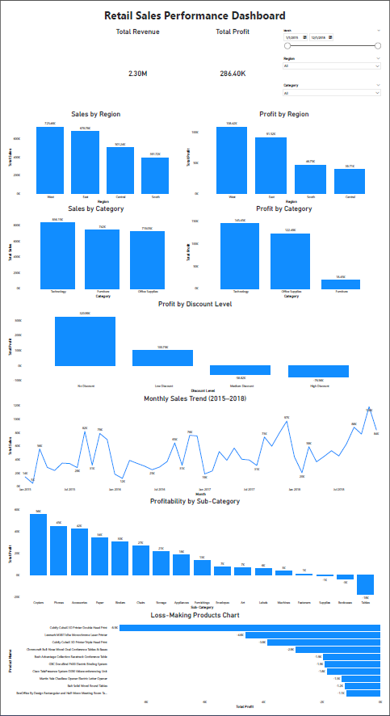

# Retail Sales Performance Analysis

## Project Overview
This project analyzes retail sales performance using PostgreSQL and Power BI. The goal is to identify key business patterns across revenue, profit, product categories, regions, discount strategy, and seasonal sales trends, and to translate the findings into actionable business insights.

The analysis was conducted on 9,994 retail transactions from the Superstore Sales dataset. PostgreSQL was used for structured querying and reusable analytical views, while Power BI was used to develop an interactive executive dashboard.

## Dataset
- **Dataset:** Superstore Sales Dataset
- **Rows:** 9,994
- **Columns:** 21

## Tools Used
- PostgreSQL
- pgAdmin
- SQL
- VS Code
- Power BI
- GitHub
- Notion

## Business Questions
This project answers the following questions:

- What is the total revenue generated by the business?
- What is the total profit generated by the business?
- Which regions generate the highest sales?
- Which product categories perform best in terms of sales and profit?
- What are the top-selling products?
- How do monthly sales trends change over time?
- Which products or categories show low or negative profitability?

## Key Findings
- **Total Revenue:** $2.30M
- **Total Profit:** $286.4K
- The **West** region generated the highest sales and profit
- **Technology** was the strongest-performing category by both revenue and profit
- **Furniture** generated high sales but relatively weak profit
- Medium and high discount levels significantly reduced profitability
- Sales showed strong seasonal peaks in **Q4**
- **Tables** was the weakest-performing sub-category by profit
- Several products generated strong revenue while still producing losses

## SQL Views Created
The following analytical views were created for reporting and dashboard integration:

- `v_sales_kpis`
- `v_regional_performance`
- `v_category_performance`
- `v_subcategory_profitability`
- `v_monthly_sales_trend`
- `v_discount_analysis`
- `v_product_profitability`

## Dashboard Preview

## Dashboard Features
The Power BI dashboard includes:

- Total Revenue and Total Profit KPI cards
- Sales by Region
- Profit by Region
- Sales by Category
- Profit by Category
- Profit by Discount Level
- Monthly Sales Trend
- Profitability by Sub-Category
- Top 10 Loss-Making Products
- Interactive slicers for Month, Region, and Category

## Business Recommendations
Based on the analysis, the business should:

- prioritize investment in high-performing regions such as the West and East
- review cost and pricing issues affecting weaker profitability in the Central region
- optimize discounting policies to protect margins
- focus on high-margin categories such as Technology
- closely review loss-making products and underperforming sub-categories
- plan inventory and campaigns proactively around Q4 demand spikes

## Project Structure
- `data/` → cleaned dataset
- `sql/` → SQL scripts and analytical views
- `dashboard/` → Power BI dashboard file
- `docs/` → exported project documentation
- `images/` → SQL output screenshots and dashboard image

## Author
**Pius Denilson Goodluck**  
Aspiring Data Analyst focused on SQL, Power BI, Excel, and business intelligence.